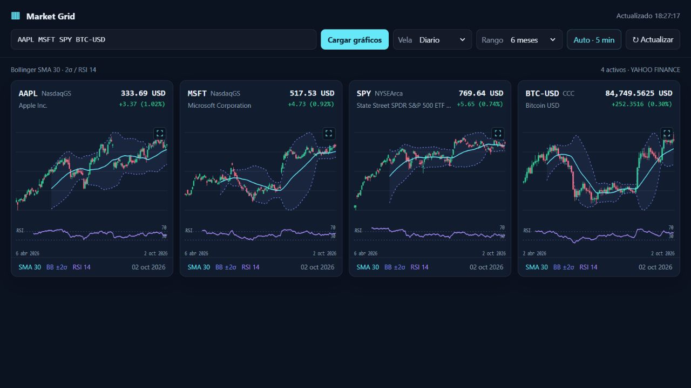

# Market Grid — Python + HTML/JavaScript

Una aplicación local para consultar activos y visualizar velas, Bollinger y RSI. Python obtiene y procesa los datos; HTML/CSS/JavaScript dibuja las gráficas en el navegador. No requiere una cuenta, claves de API, Node ni publicar un sitio.

## Vista de ejemplo

Captura real de la aplicación ejecutándose con `AAPL MSFT SPY BTC-USD`, velas diarias y un rango de seis meses. Se tomó el 3 de octubre de 2026; las cotizaciones y el historial disponible cambian con el tiempo. Son ejemplos genéricos, no una cartera ni recomendaciones de inversión.



## Ejecutar

Necesitas Python 3.11 o posterior, un navegador moderno e Internet para consultar los precios.

1. Descarga y descomprime el proyecto, o clona este repositorio.
2. Abre una terminal dentro de esta carpeta.
3. Ejecuta:

```console
python run.py
```

En Windows también puedes usar `py run.py`. Se abrirá el navegador en `http://127.0.0.1:8000/`. Deja la terminal abierta; `Ctrl+C` cierra la aplicación. Si el puerto está ocupado:

```console
python run.py --port 8123
```

Para iniciar sin abrir automáticamente el navegador: `python run.py --no-browser`.

No abras `index.html` con doble clic: los datos e indicadores necesitan el servidor Python. No funciona en GitHub Pages por sí solo: GitHub puede distribuir el código, pero el usuario debe ejecutar Python localmente.

## Funciones

- Tickers separados por espacios, comas o punto y coma; elimina duplicados, sin límite fijo de activos.
- Cuatro columnas en escritorio, dos en tablet y una en móvil; la cuadrícula crece hacia abajo.
- Velas desde un minuto hasta una semana y rangos compatibles hasta el historial máximo disponible.
- SMA de 30 velas, Bollinger con desviación poblacional de 2σ y RSI de Wilder de 14 períodos, calculados en Python sobre el historial completo recibido.
- Actualización manual y automática cada cinco minutos mientras la aplicación permanezca abierta; el navegador puede demorar temporizadores en segundo plano.
- Clic, Enter o espacio sobre una gráfica para ampliarla a toda la ventana. Botón de regreso y Escape para volver. La vista ampliada conserva los controles de vela y rango; los cambios se aplican a toda la cuadrícula.
- Información de OHLC/indicadores al pasar el cursor; icono pequeño y cursor de lupa para ampliar.
- Durante la actualización se conserva el historial anterior. Los fallos muestran un aviso y permiten reintentar.
- Preferencias guardadas únicamente en el navegador utilizado.

Para mantener legibilidad, JavaScript agrupa visualmente historiales largos en un máximo aproximado de 140 velas. No recorta el período: conserva su inicio y final, y agrega OHLC/volumen por grupo. Los indicadores se calculan **antes** de esta agrupación. El precio mostrado corresponde a la última vela disponible; no es un flujo de cotizaciones tick-by-tick.

## Separación del proyecto

```text
run.py                    Arranque de la GUI local
market_grid/market.py     Consulta de datos + cálculos independientes
market_grid/server.py     Servidor local y API
market_grid/web/          HTML, CSS, JavaScript y SVG sin compilación
tests/                    Pruebas con datos sintéticos, sin Internet
scripts/check_public.py   Revisión previa a compartir
```

El núcleo se puede utilizar sin abrir ninguna interfaz:

```python
from market_grid import get_market_data, calculate_indicators

data = get_market_data("SPY", interval="1d", range_key="1y")
print(data["points"][-1]["rsi"])
```

`calculate_indicators(candles)` recibe velas ordenadas cronológicamente con `close` numérico y conserva los campos originales. Añade `sma`, `upper`, `lower` y `rsi`. Los indicadores sin suficientes observaciones son `None`. Para mantener el comportamiento original, RSI vale 100 si la pérdida media es cero, incluso en una serie plana.

La interfaz solo depende de estas rutas del mismo origen:

- `GET /api/config`: intervalos, rangos, ejemplos y temporizador.
- `GET /api/market?symbol=SPY&interval=1d&range=1y`: metadatos, `previousClose`, `candles` y `points` enriquecidos con indicadores. Cada vela contiene `time` (segundos Unix), `open`, `high`, `low`, `close` y `volume`.

Eso permite reutilizar la interfaz con otro adaptador sin acoplar el núcleo Python a un servicio de publicación. Este repositorio no contiene configuraciones, credenciales, identificadores ni herramientas de despliegue de Sites.

## Verificar antes de compartir

```console
python -B -m unittest discover -s tests -v
python -B scripts/check_public.py
```

Opcional para desarrolladores con Node 22 o posterior: `node --test tests/charts.test.mjs` comprueba que la agrupación visual conserve el período completo. Node no se necesita para ejecutar la aplicación.

Comparte **solo esta carpeta** y crea un historial Git nuevo dentro de ella, no el historial del proyecto del que proviene. No subas la carpeta contenedora, archivos personales, configuraciones de publicación, cachés ni `.env`. El escáner no garantiza ausencia absoluta de secretos ni examina el historial Git; revisa los archivos antes de hacer público el repositorio. Consulta [SECURITY.md](SECURITY.md).

La ejecución directa no tiene dependencias externas. Opcionalmente se puede instalar como paquete con `python -m pip install -e .` y arrancar con `market-grid` o `python -m market_grid`; solo el proceso de instalación utiliza setuptools.

## Datos y límites

La fuente actual es el endpoint de gráficos de Yahoo Finance. Puede limitar solicitudes, cambiar su respuesta o no disponer de ciertos intervalos. La aplicación usa caché en memoria y hasta cuatro consultas simultáneas; agregar muchos activos aumenta el tiempo de carga. La fuente no se acompaña de un SLA y sus datos pueden tener retrasos. Comprueba los términos aplicables del proveedor para tu uso o redistribución de datos.

Los tickers se envían a Yahoo Finance; no hay acceso a brokers ni operaciones de compra/venta. Los ejemplos son genéricos y no constituyen una cartera ni recomendaciones de inversión.

El servidor está limitado a `127.0.0.1`. **No lo expongas a Internet** ni cambies el enlace a `0.0.0.0`: es una GUI local, no un servicio de producción público.

## Licencia

No se ha seleccionado una licencia de código abierto para esta distribución. Antes de permitir reutilización bajo una licencia específica, el propietario debe elegirla y añadir el archivo correspondiente. Hacer un repositorio público no sustituye esa decisión.
